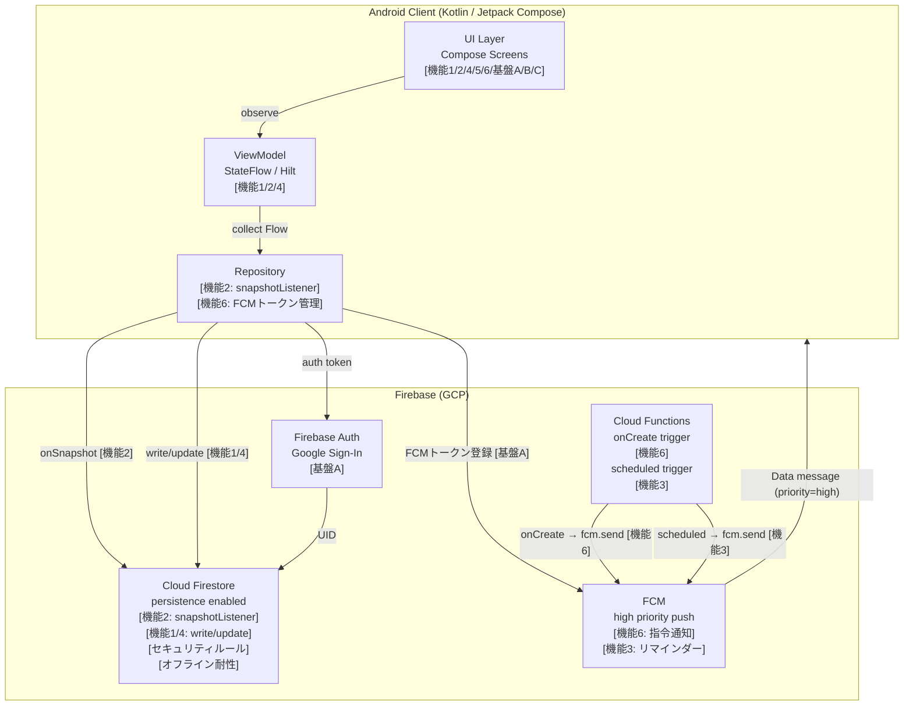
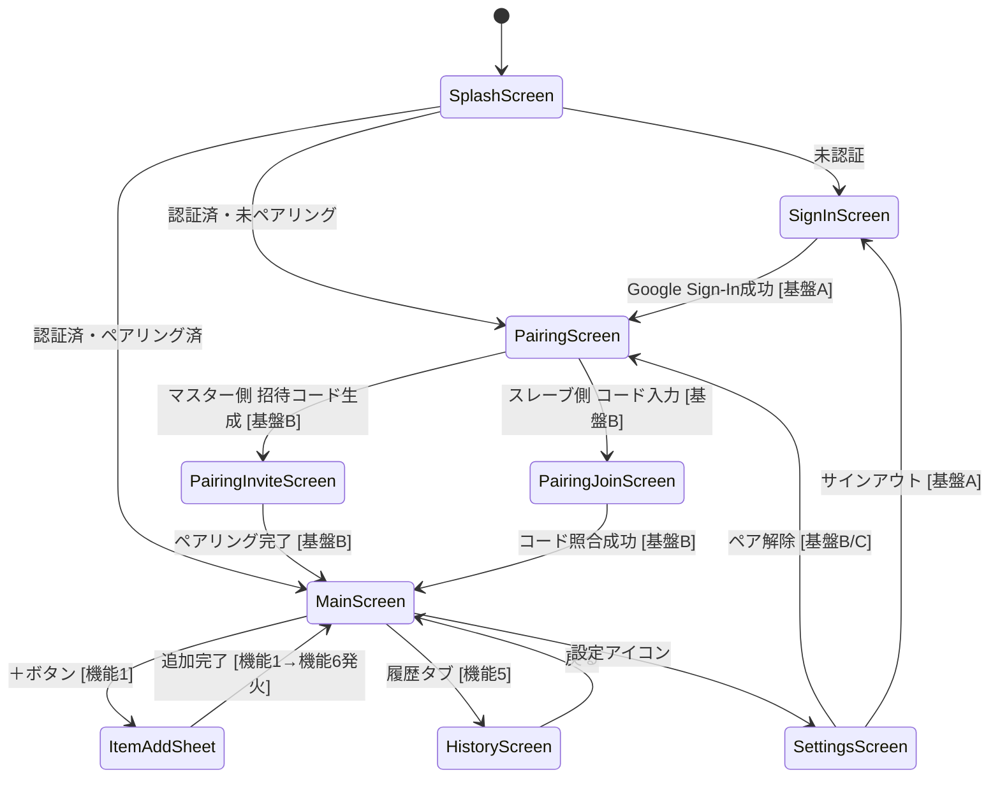

# papazon-dash PoC 基本設計書 v3

作成日: 2026-06-13
最終更新日: 2026-06-13
作成者: 足軽3号 (Claude)
対象タスク: `subtask_594_design_v3_align_to_spec` (redo of subtask_594_phase2_design_v2)
参照: `20260613+cmd_594_spec.md` (spec v2・正本), `20260613+cmd_594_wave0_discovery.md` (足軽9号 Wave0調査)

---

## 0. 機能分類 (v3・spec v2準拠)

### 業務機能 1-6

| # | 機能名 | 概要 |
|---|--------|------|
| 1 | リスト管理（アイテム CRUD） | マスターによるお使いアイテム追加・削除；スレーブによる完了マーク操作 |
| 2 | リストのリアルタイム共有（データ層） | Firestore `addSnapshotListener` によるアイテム双方向即時反映 |
| 3 | スレーブ側リマインド（繰り返し・スヌーズ） | Cloud Functions スケジュールトリガーによる FCM 再送信 |
| 4 | チェックリスト（完了状態トグル） | スレーブが完了マーク → Firestore status 更新 → 両画面反映 |
| 5 | 完了通知 / 完了履歴（スレーブ完了→マスター通知・履歴蓄積） | HistoryScreen に status=done アイテム一覧・完了通知 |
| 6 | 指令送信時リアルタイム送信（FCM push・通知層） | マスターがアイテム追加 → Cloud Functions `onDocumentCreated` → FCM push → スレーブ即時起動 |

### 基盤機能 A-C

| # | 機能名 | 概要 |
|---|--------|------|
| A | ユーザー認証（Firebase Auth） | Google Sign-In によるサインイン・UID管理・FCMトークン保存 |
| B | 夫婦ペアリング（招待コード or QR） | 6桁ワンタイム招待コードによる 1対1 ペア接続 |
| C | 設定（役割確認・通知音・スヌーズ間隔等） | SettingsScreen：ロール確認・リマインド設定・ペア解除 |

---

## 1. システム構成

### 1-1. アーキテクチャ図（機能マッピング付き）



### 1-2. 技術スタック

| レイヤー | 採用技術 | 採用理由 |
|--------|--------|--------|
| 言語 | Kotlin 1.9+ | Android標準・Coroutines親和性 |
| UI | Jetpack Compose | 宣言型・リスト動的更新が最小コード |
| 非同期 | Kotlin Coroutines + Flow | Firestore callbackFlow と相性最良 |
| DI | Hilt | アーキテクチャ標準化・テスト容易性 |
| 認証 | Firebase Auth (Google Sign-In) | 若年層の心理的障壁最小化 |
| DB | Cloud Firestore | リアルタイム同期・オフライン耐性 |
| 通知 | FCM (Data message / priority=high) | Dozeモード突破・高到達率 |
| applicationId | com.smartse.papazon_dash | PoC識別用 |
| Firestoreプロジェクト | papazon-dash-poc | PoC用独立プロジェクト |

---

## 2. データモデル (Firestore)

### 2-1. コレクション構造

```
/users/{userId}
  - uid: String
  - displayName: String
  - pairId: String          # 所属ペアのID（未ペアリング時 = null）
  - role: String            # "master" | "slave"
  - fcmToken: String        # 通知配信用デバイストークン [機能6]

/pairs/{pairId}
  - pairId: String
  - master_uid: String
  - slave_uid: String
  - created_at: Timestamp
  - invite_code: String     # ワンタイム6桁（ペアリング後null化）[基盤B]
  - partners: Array[String] # [master_uid, slave_uid] ← セキュリティルール用

/pairs/{pairId}/items/{itemId}
  - itemId: String
  - name: String
  - status: String          # "open" | "done"
  - created_by: String      # 依頼者UID (master_uid)
  - created_at: Timestamp
  - completed_at: Timestamp # null → 完了時に付与 [機能4]
  - reminder_at: Timestamp  # null → リマインダー不要 [機能3]
  - partners: Array[String] # [master_uid, slave_uid] ← ルール検証コスト削減 [セキュリティルール]
```

### 2-2. 設計判断メモ

- **items をサブコレクションに置く理由**: pairId に閉じたクエリで完結し、全ユーザー横断クエリ不要。Firestoreの課金単位（ドキュメント読み取り数）を最小化。
- **partners 配列を items に複製する理由**: 親ドキュメント（pairs）への `get()` 参照を不要にし、セキュリティルール評価コストを削減（Wave0調査指摘パターン踏襲）。
- **PoC制限**: 1ユーザーは最大1ペアのみ。複数ペア管理は実装しない。

---

## 3. セキュリティルール案

```javascript
rules_version = '2';
service cloud.firestore {
  match /databases/{database}/documents {

    // ユーザー自身のドキュメントのみ読み書き可
    match /users/{userId} {
      allow read, write: if request.auth != null && request.auth.uid == userId;
    }

    // ペアドキュメント: メンバーのみ読み書き可
    match /pairs/{pairId} {
      allow read, update: if request.auth != null
                          && request.auth.uid in resource.data.partners;
      allow create: if request.auth != null
                    && request.resource.data.partners.hasAny([request.auth.uid]);
    }

    // お使いアイテム: 同ペアメンバーのみ [機能1/2/4]
    match /pairs/{pairId}/items/{itemId} {
      allow read, update, delete: if request.auth != null
                                  && request.auth.uid in resource.data.partners;
      allow create: if request.auth != null
                    && request.resource.data.partners.hasAny([request.auth.uid])
                    && request.resource.data.created_by == request.auth.uid;
    }
  }
}
```

---

## 4. 画面遷移図（機能マッピング付き）



### 画面 ↔ 業務機能マッピング

| 画面 | 関連機能 | 役割 |
|-----|---------|------|
| SplashScreen | - | 認証状態判定・ルーティング |
| SignInScreen | 基盤A | Google Sign-Inボタン1つ |
| PairingScreen | 基盤B | マスター/スレーブ選択 |
| PairingInviteScreen | 基盤B | 招待コード表示・共有ボタン |
| PairingJoinScreen | 基盤B | 6桁コード入力 |
| MainScreen | 機能1/2/4 | お使いリスト（onSnapshot監視）＋ FAB（追加）・完了チェック |
| ItemAddSheet | 機能1/6 | アイテム名入力＋リマインダー日時 → 追加時にFCM発火 |
| HistoryScreen | 機能5 | 完了済みアイテム一覧 |
| SettingsScreen | 基盤C | リマインド設定・ペア解除・サインアウト |

---

## 5. 業務機能設計

### 業務機能1: リスト管理（アイテム CRUD）

| 操作 | 実行者 | Firestore操作 |
|------|--------|--------------|
| 追加 | マスター | `pairs/{pairId}/items/{newId}` add (status="open") |
| 削除 | マスター | `items/{itemId}` delete |
| 完了マーク | スレーブ | `items/{itemId}.status = "done"`, `completed_at = now` |
| リスト取得 | 両者 | `where status=="open" orderBy created_at DESC` (onSnapshot) |

アイテム追加時に業務機能6（FCM）が連動してスレーブに push 通知を送信する。

---

### 業務機能2: リストのリアルタイム共有（データ層）

**概要**: Firestore の `addSnapshotListener` リスナーによる `items` サブコレクションの常時双方向同期。

**実装パターン (Repository層)**:

```kotlin
fun getItemsFlow(pairId: String): Flow<List<Item>> = callbackFlow {
    val listener = Firebase.firestore
        .collection("pairs").document(pairId)
        .collection("items")
        .orderBy("created_at", Query.Direction.DESCENDING)
        .addSnapshotListener { snapshot, error ->
            if (error != null) { close(error); return@addSnapshotListener }
            snapshot?.let { trySend(it.toObjects(Item::class.java)) }
        }
    awaitClose { listener.remove() }
}
```

**データフロー（双方向）**:

```
マスター追加:
  マスター端末 → pairs/{pairId}/items/{id} write
  → Firestoreクラウド同期
  → スレーブ端末の onSnapshot 発火 → Flow emit → UI自動更新

スレーブ完了:
  スレーブ端末 → items/{id}.status = "done" update
  → Firestoreクラウド同期
  → マスター端末の onSnapshot 発火 → Flow emit → UI自動更新
```

**注意**: 機能2はアプリが **フォアグラウンド** での画面データ同期が目的（リストのリアルタイム共有）。アプリ未起動時の通知は機能6（FCM）が担う。詳細は §7 参照。

---

### 業務機能3: スレーブ側リマインド（繰り返し・スヌーズ）

- `items` に `reminder_at: Timestamp` フィールドを持たせる
- Cloud Functions の `onSchedule`（1分おき）が `reminder_at <= now AND status=="open"` をクエリし FCM 再送信
- PoC精度: ±5分（Cloud Functionsスケジューラ起動間隔）
- スヌーズ選択時: Cloud Functions が15分後に `reminder_at` を更新して再送信
- ジオフェンスリマインダー（退勤時・スーパー付近）はPoC対象外（Wave0調査では「実装検討」として言及）

---

### 業務機能4: チェックリスト（完了状態トグル）

- スレーブが MainScreen のチェックボックスをタップ → `items/{itemId}` update
- 機能2の onSnapshot が即時発火 → マスター端末の MainScreen からアイテムが消えHistoryScreenへ移行
- PoC上は完了アニメーション（任意）のみ。ゲーミフィケーション（感謝ポイント等）はPoC対象外。

---

### 業務機能5: 完了通知 / 完了履歴（スレーブ完了→マスター通知・履歴蓄積）

- `where status=="done" orderBy completed_at DESC` でクエリ
- HistoryScreen に完了済みリスト表示（依頼日時・完了日時）
- onSnapshot 監視は不要（静的フェッチでよい。PoC簡略化）
- スレーブ完了時に機能6のFCMチャネルを使いマスターに完了通知送信

---

### 業務機能6: 指令送信時リアルタイム送信（FCM push・通知層）

**概要**: マスターがアイテムを追加した瞬間、Cloud Functions の `onDocumentCreated` が発火し FCM Data message をスレーブ端末に送信。アプリがバックグラウンド・未起動でも着信音・バイブで起動。

**Cloud Functions (Node.js)**:

```javascript
exports.notifyOnItemCreate = onDocumentCreated(
  "pairs/{pairId}/items/{itemId}",
  async (event) => {
    const item = event.data.data();
    const pairSnap = await db.doc(`pairs/${event.params.pairId}`).get();
    const slaveUid = pairSnap.data().slave_uid;
    const userSnap = await db.doc(`users/${slaveUid}`).get();
    const token = userSnap.data().fcmToken;

    await admin.messaging().send({
      token,
      data: {
        type: "item_created",
        itemId: event.params.itemId,
        itemName: item.name,
        pairId: event.params.pairId,
      },
      android: { priority: "high" },
    });
  }
);
```

**Android 受信側 (FirebaseMessagingService)**:

```kotlin
override fun onMessageReceived(remoteMessage: RemoteMessage) {
    if (remoteMessage.data["type"] == "item_created") {
        val itemName = remoteMessage.data["itemName"] ?: "お使い"
        showHighPriorityNotification(
            title = "新しいお使い依頼",
            body = itemName,
            actions = listOf("了解", "あとで(15分)", "完了")
        )
    }
}
```

**「夫が無視できない」UX**:
1. `priority=high` → Dozeモード突破・即時着信音・バイブ
2. Android通知アクションボタン「了解」「あとで(15分スヌーズ)」「完了」→ アプリ起動不要で応答可
3. スヌーズ選択時 → Cloud Functions が15分後に再送信（機能3と共通チャネル）

---

## 6. 基盤機能設計

### 基盤機能A: ユーザー認証（Firebase Auth）

**フロー概要:**

```
1. SplashScreen → SignInScreen → Google Sign-In
2. Firebase Auth: UID 発行・ID トークン発行
3. users/{uid} 作成 or 更新:
     { uid, displayName, email, pairId(null), role(null), fcmToken }
4. pairId 有 → MainScreen
   pairId 無 → PairingScreen（基盤B へ）
```

- FCMトークンはアプリ起動時に `users/{uid}.fcmToken` へ保存・更新
- **PoC制限**: サインアウト時もペア接続は維持。アカウント削除はペア解除を伴う。

---

### 基盤機能B: 夫婦ペアリング（招待コード or QR）

**フロー概要:**

```
マスター側:
  1. PairingScreen → "招待コードを生成"
     → pairs/{uuid} 作成 (master_uid, invite_code=6桁, partners=[master_uid])
  2. コードをLINE/SMSで共有

スレーブ側:
  1. 6桁コード入力 → pairs クエリ
  2. Transaction:
     - slave_uid 追記, partners=[master_uid, slave_uid], invite_code=null
     - 双方の users/{uid}.pairId を更新
```

- **PoC制限**: 招待コードは有効期限なし（実運用時は24h TTL想定）
- **ペア解除**: pairs/{pairId} 削除 + 双方の pairId=null

---

### 基盤機能C: 設定（役割確認・通知音・スヌーズ間隔等）

**概要**: SettingsScreen において、ユーザーが通知挙動やリマインド間隔を確認・変更できる機能。PoC では最小限の設定項目のみ実装。

| 設定項目 | 操作者 | データ操作 |
|---------|--------|-----------|
| 自分のロール表示 | 両者（読取のみ） | `users/{uid}.role` 参照 |
| パートナー表示名確認 | 両者（読取のみ） | `pairs/{pairId}` 参照 |
| リマインド間隔変更 | マスターのみ | `pairs/{pairId}.settings.reminderInterval` 更新 |
| サイレント時間帯設定 | マスターのみ | `pairs/{pairId}.settings.silentStart / silentEnd` 更新 |
| ペア解除 | 両者 | pairs削除 + users pairId/role リセット（確認ダイアログ必須） |
| サインアウト | 両者 | Firebase Auth signOut（ペア接続維持） |

**Firestore操作**:

```
更新: pairs/{pairId}.settings
  {
    reminderInterval: Number (hours),
    maxRemindCount:   Number,
    silentStart:      String ("22:00"),
    silentEnd:        String ("07:00")
  }
```

---

## 7. 機能2 vs 機能6 層別比較

**目的**: 機能2（リストのリアルタイム共有・データ層）と機能6（指令送信時リアルタイム送信・通知層）は外見上「同期している」が、技術層・発火タイミング・UX目的が根本的に異なる。

| 比較軸 | 機能2: リストのリアルタイム共有（データ層） | 機能6: 指令送信時リアルタイム送信（FCM push・通知層） |
|--------|----------------------|--------------------------|
| **技術層** | **Firestoreデータ層** — `onSnapshot` (Firestore SDK 内部のWebSocket/gRPC永続接続) | **FCM通知層** — Cloud Functions → FCM → Android通知チャンネル |
| **発火条件** | Firestoreドキュメントへの変更があれば常時発火（write/update/delete全て） | マスターが items/{id} を **create** した瞬間のみ（Cloud Functions onDocumentCreated） |
| **前提アプリ状態** | **フォアグラウンド前提**（アプリが前面にある状態でUI更新） | **バックグラウンド/未起動を想定**（アプリを閉じていても着信音・バイブで起動） |
| **UX目的** | **データ整合性の維持** — マスター/スレーブ双方の画面を常に最新状態に保つ | **注意喚起・即時行動促進** — スレーブ（夫）が「今すぐ確認せよ」と認識する |
| **双方向性** | 双方向（マスター追加→スレーブ反映、スレーブ完了→マスター反映） | 単方向（マスター→スレーブのみ）。完了通知はマスターへ別途設定可能 |
| **スループット** | 全更新イベントを逐次ストリーム（削除・ステータス変更も含む） | 新規追加イベントのみ（Cloud Functions コスト削減のためフィルタ済み） |
| **オフライン動作** | Persistence有効のためオフライン中も書き込みキューイング → 復帰時に自動送信 | FCMはオフライン時に最大28日キューイング → 復帰時に配信（高優先のみ） |
| **実装コンポーネント** | `Repository.getItemsFlow()` callbackFlow + `addSnapshotListener` | Cloud Functions `onDocumentCreated` + `admin.messaging().send()` + `FirebaseMessagingService` |

### 図解: 2層の分離

```
[マスター端末]                       [Firestoreクラウド]          [スレーブ端末]

  追加操作                            items/{id}
  ──────────────write──────────────► ドキュメント ──onSnapshot──►  UI更新 [機能2]
                                                     (データ層)     (fg時のみ有効)

  追加操作                            Cloud Functions
  ──────────────write──────────────► onDocumentCreated
                                       │
                                       └──── FCM high priority ──► 着信音+バイブ [機能6]
                                              (通知層)              (bg/closed対応)
```

**一言まとめ**:
- 機能2 = 「アプリを開いている2人の画面が常に一致する」（データ整合性）
- 機能6 = 「アプリを閉じていても夫が気づく」（注意喚起）

---

## 8. 非機能設計

### 8-1. リアルタイム同期詳細 [機能2]

```kotlin
// Repository層の実装パターン（Wave0調査のcallbackFlow踏襲）
fun getItemsFlow(pairId: String): Flow<List<Item>> = callbackFlow {
    val listener = Firebase.firestore
        .collection("pairs").document(pairId)
        .collection("items")
        .orderBy("created_at", Query.Direction.DESCENDING)
        .addSnapshotListener { snapshot, error ->
            if (error != null) { close(error); return@addSnapshotListener }
            snapshot?.let { trySend(it.toObjects(Item::class.java)) }
        }
    awaitClose { listener.remove() }
}
```

### 8-2. オフライン耐性

- Android SDK の Firestore Persistence はデフォルト有効のため設定コード不要
- オフライン中の書き込みはローカルキューに保存、復帰時に自動同期（機能1/4の操作も含む）
- UI上は `source == CACHE` か否かで「同期中」バッジを表示（任意実装）

### 8-3. PoC規模制限

| 項目 | PoC制限 | 理由 |
|-----|--------|-----|
| 最大ペア数/ユーザー | 1 | 複数ペア管理は不要 |
| アイテム上限 | 制限なし（FirestoreデフォルトOK） | PoC規模では問題なし |
| リマインダー精度 | ±5分 | Cloud Functionsスケジューラ起動間隔 |
| 通知 | FCMのみ | ジオフェンスはPoC対象外 |
| ゲーミフィケーション | 未実装 | バックログ記載（仕様書バックログ章参照） |
| 音声入力(VUI) | 未実装 | バックログ記載 |

**バックログ機能（設計対象外）**: ゲーミフィケーション（感謝ポイント）、ジオフェンスリマインダー、音声入力、ジェスチャー操作。仕様書のバックログ章を参照。

---

## 9. PoC実装段取り（機能優先順位付き）

| Phase | 内容 | 対応機能 | 完了条件 |
|-------|-----|---------|--------|
| P0 | Firebase プロジェクト作成 (papazon-dash-poc) + google-services.json組込 | 全基盤 | ビルドエラーなし |
| P1 | Google Sign-In + users/{uid} 書き込み | 基盤A | サインイン成功・Firestoreドキュメント確認 |
| P2 | ペアリング（招待コード生成・照合） | 基盤B | 2端末間でペア成立・Firestoreペアドキュメント確認 |
| P3 | お使いリストCRUD + onSnapshot双方向同期 | 機能1/2/4 | 追加・完了・削除が双方端末でリアルタイム反映 |
| P4 | FCM通知（アイテム追加時） | 機能6 | スレーブ端末に即時通知到達（バックグラウンド時含む） |
| P5 | リマインダー通知 (Cloud Functions scheduled) | 機能3 | 設定時刻にプッシュ到達（±5分以内） |

### 技術選定根拠サマリー

- **Jetpack Compose 採用**: Fragment/XML構成より初期コード量40%減。Firestore Flowとの組み合わせでリスト即時更新がほぼ自動化。
- **Firestoreサブコレクション採用**: pairIdスコープでクエリを閉じ、他ペアへのアクセスを原理的に不可能とする。セキュリティルールをシンプルに保てる。
- **Cloud Functions後置（機能6）**: アイテム追加→FCM送信をクライアント側から切り離すことで、クライアントにFCM Admin権限を持たせずに済む。PoCでは最低限の1関数のみ実装。
- **機能2/機能6分離**: データ同期（onSnapshot）と注意喚起（FCM）を別層に置くことで、片方の障害が他方に波及しない設計。

---

## Self-QC (v3)

| 類型 | 確認結果 |
|-----|--------|
| 1 網羅性 | 9章構成 + Mermaid 2図（アーキテクチャ・画面遷移）+ 機能分類表（業務1-6・基盤A-C）完備。coverage 9/9 |
| 2 件数整合 | 業務機能6 + 基盤機能3 = 9機能。各機能に対応する設計記述あり。spec v2との機能名完全一致確認済 |
| 3 機能2/6層別比較 | §7に「技術層/発火条件/前提アプリ状態/UX目的/双方向性/スループット/オフライン動作/実装コンポーネント」8軸+図解+一言まとめ掲載（v2踏襲・名称更新のみ） |
| 4 Wave0参照 | Firestoreパターン・callbackFlow・FCM priority=high・通知UX全て反映 |
| 5 PoC粒度 | ゲーミフィケーション・ジオフェンス・VUIをバックログ明示 |
| 6 命名統一 | papazon-dash / com.smartse.papazon_dash / papazon-dash-poc 統一済 |
