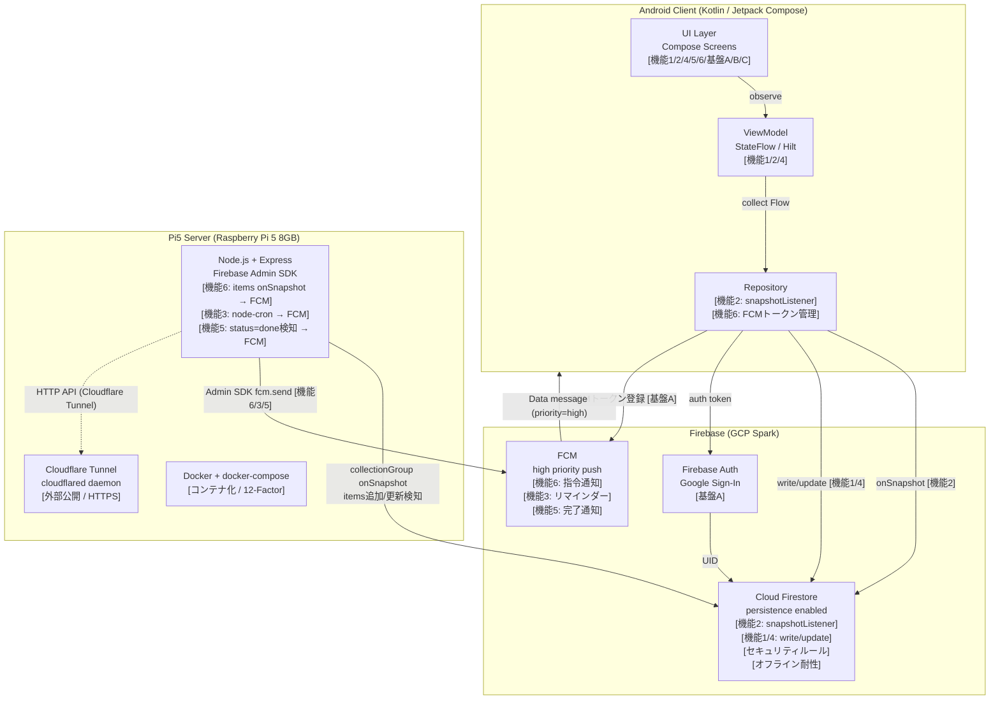
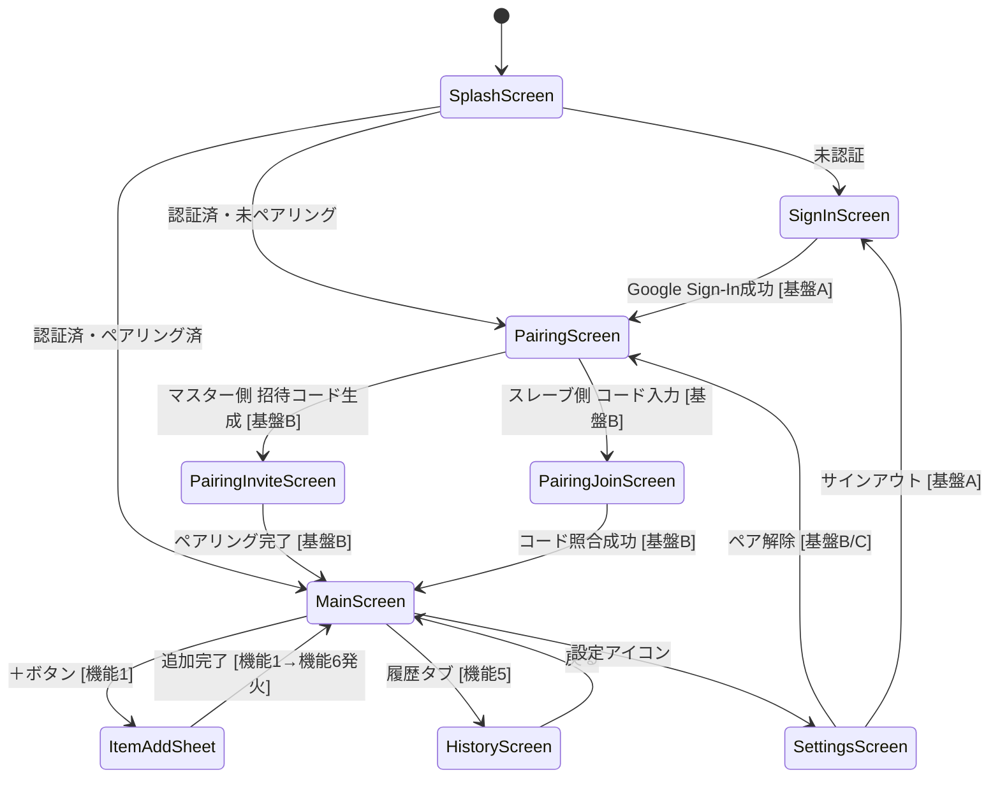

# papazon-dash PoC 基本設計書 v4

作成日: 2026-06-17
最終更新日: 2026-06-17
作成者: 足軽3号 (Claude)
対象タスク: `subtask_594f_design_v4_wbs_v2`
参照: `20260613+cmd_594_spec.md` (spec v2・正本), `20260613+cmd_594_design.md` (v3・前版)

**v4変更概要**: Cloud Functions (GCP Blaze課金必須) を廃止し、Pi5自前サーバー (Node.js + Express + Firebase Admin SDK) に置換。12-Factor準拠のDocker化・Cloudflare Tunnel外部公開・AWS移行可能性を追加。

---

## 0. 機能分類 (v4・spec v2準拠)

### 業務機能 1-6

| # | 機能名 | 概要 |
|---|--------|------|
| 1 | リスト管理（アイテム CRUD） | マスターによるお使いアイテム追加・削除；スレーブによる完了マーク操作 |
| 2 | リストのリアルタイム共有（データ層） | Firestore `addSnapshotListener` によるアイテム双方向即時反映 |
| 3 | スレーブ側リマインド（繰り返し・スヌーズ） | **Pi5サーバー node-cron** による FCM 再送信（v3: Cloud Functions onSchedule → v4: node-cron） |
| 4 | チェックリスト（完了状態トグル） | スレーブが完了マーク → Firestore status 更新 → 両画面反映 |
| 5 | 完了通知 / 完了履歴（スレーブ完了→マスター通知・履歴蓄積） | HistoryScreen に status=done アイテム一覧・完了通知 |
| 6 | 指令送信時リアルタイム送信（FCM push・通知層） | マスターがアイテム追加 → **Pi5サーバー Firestore collectionGroup onSnapshot** → FCM push → スレーブ即時起動（v3: Cloud Functions onDocumentCreated → v4: Pi5 onSnapshot） |

### 基盤機能 A-C

| # | 機能名 | 概要 |
|---|--------|------|
| A | ユーザー認証（Firebase Auth） | Google Sign-In によるサインイン・UID管理・FCMトークン保存 |
| B | 夫婦ペアリング（招待コード or QR） | 6桁ワンタイム招待コードによる 1対1 ペア接続 |
| C | 設定（役割確認・通知音・スヌーズ間隔等） | SettingsScreen：ロール確認・リマインド設定・ペア解除 |

---

## 1. システム構成

### 1-1. アーキテクチャ図（v4・Pi5サーバー構成）



### 1-2. 技術スタック

#### Android (変更なし)

| レイヤー | 採用技術 | 採用理由 |
|--------|--------|--------|
| 言語 | Kotlin 1.9+ | Android標準・Coroutines親和性 |
| UI | Jetpack Compose | 宣言型・リスト動的更新が最小コード |
| 非同期 | Kotlin Coroutines + Flow | Firestore callbackFlow と相性最良 |
| DI | Hilt | アーキテクチャ標準化・テスト容易性 |
| 認証 | Firebase Auth (Google Sign-In) | 若年層の心理的障壁最小化 |
| DB | Cloud Firestore | リアルタイム同期・オフライン耐性 |
| 通知 | FCM (Data message / priority=high) | Dozeモード突破・高到達率 |
| applicationId | com.smartse.papazon_dash | PoC識別用 |
| Firestoreプロジェクト | papazon-dash-poc | PoC用独立プロジェクト |

#### Pi5サーバー (v4 新設)

| レイヤー | 採用技術 | 採用理由 |
|--------|--------|--------|
| ランタイム | Node.js 20 LTS | Firebase Admin SDK 公式サポート・豊富なエコシステム |
| フレームワーク | Express 4 | シンプルなHTTP API・ミドルウェア豊富 |
| FCM/Firestore | firebase-admin SDK | Admin権限でFCM送信・Firestoreリスナー |
| スケジュール | node-cron | 軽量・cron式直感的・Cloud Functions代替 |
| コンテナ | Docker + docker-compose | 12-Factor準拠・環境再現性 |
| 外部公開 | Cloudflare Tunnel (cloudflared) | 静的IP不要・HTTPS自動・無料 |
| ハードウェア | Raspberry Pi 5 8GB | 常時稼働・低消費電力・PoC最適 |

---

## 2. データモデル (Firestore) ── v3から変更なし

### 2-1. コレクション構造

```
/users/{userId}
  - uid: String
  - displayName: String
  - pairId: String          # 所属ペアのID（未ペアリング時 = null）
  - role: String            # "master" | "slave"
  - fcmToken: String        # 通知配信用デバイストークン [機能6]

/pairs/{pairId}
  - pairId: String
  - master_uid: String
  - slave_uid: String
  - created_at: Timestamp
  - invite_code: String     # ワンタイム6桁（ペアリング後null化）[基盤B]
  - partners: Array[String] # [master_uid, slave_uid] ← セキュリティルール用

/pairs/{pairId}/items/{itemId}
  - itemId: String
  - name: String
  - status: String          # "open" | "done"
  - created_by: String      # 依頼者UID (master_uid)
  - created_at: Timestamp
  - completed_at: Timestamp # null → 完了時に付与 [機能4]
  - reminder_at: Timestamp  # null → リマインダー不要 [機能3]
  - partners: Array[String] # [master_uid, slave_uid] ← ルール検証コスト削減
```

### 2-2. 設計判断メモ (v3継承)

- **items をサブコレクションに置く理由**: pairId に閉じたクエリで完結。Firestoreの課金単位（ドキュメント読み取り数）を最小化。
- **partners 配列を items に複製する理由**: 親ドキュメントへの `get()` 参照を不要にし、セキュリティルール評価コストを削減。
- **PoC制限**: 1ユーザーは最大1ペアのみ。

---

## 3. セキュリティルール案 ── v3から変更なし

```javascript
rules_version = '2';
service cloud.firestore {
  match /databases/{database}/documents {

    match /users/{userId} {
      allow read, write: if request.auth != null && request.auth.uid == userId;
    }

    match /pairs/{pairId} {
      allow read, update: if request.auth != null
                          && request.auth.uid in resource.data.partners;
      allow create: if request.auth != null
                    && request.resource.data.partners.hasAny([request.auth.uid]);
    }

    match /pairs/{pairId}/items/{itemId} {
      allow read, update, delete: if request.auth != null
                                  && request.auth.uid in resource.data.partners;
      allow create: if request.auth != null
                    && request.resource.data.partners.hasAny([request.auth.uid])
                    && request.resource.data.created_by == request.auth.uid;
    }
  }
}
```

---

## 4. 画面遷移図 ── v3から変更なし



### 画面 ↔ 業務機能マッピング (v3継承)

| 画面 | 関連機能 | 役割 |
|-----|---------|------|
| SplashScreen | - | 認証状態判定・ルーティング |
| SignInScreen | 基盤A | Google Sign-Inボタン1つ |
| PairingScreen | 基盤B | マスター/スレーブ選択 |
| PairingInviteScreen | 基盤B | 招待コード表示・共有ボタン |
| PairingJoinScreen | 基盤B | 6桁コード入力 |
| MainScreen | 機能1/2/4 | お使いリスト（onSnapshot監視）＋ FAB（追加）・完了チェック |
| ItemAddSheet | 機能1/6 | アイテム名入力＋リマインダー日時 → 追加時にFCM発火 |
| HistoryScreen | 機能5 | 完了済みアイテム一覧 |
| SettingsScreen | 基盤C | リマインド設定・ペア解除・サインアウト |

---

## 5. 業務機能設計

### 業務機能1: リスト管理（アイテム CRUD）── v3から変更なし

| 操作 | 実行者 | Firestore操作 |
|------|--------|--------------|
| 追加 | マスター | `pairs/{pairId}/items/{newId}` add (status="open") |
| 削除 | マスター | `items/{itemId}` delete |
| 完了マーク | スレーブ | `items/{itemId}.status = "done"`, `completed_at = now` |
| リスト取得 | 両者 | `where status=="open" orderBy created_at DESC` (onSnapshot) |

アイテム追加時に業務機能6（FCM）が連動してスレーブに push 通知を送信する。

---

### 業務機能2: リストのリアルタイム共有（データ層）── v3から変更なし

**実装パターン (Repository層)**:

```kotlin
fun getItemsFlow(pairId: String): Flow<List<Item>> = callbackFlow {
    val listener = Firebase.firestore
        .collection("pairs").document(pairId)
        .collection("items")
        .orderBy("created_at", Query.Direction.DESCENDING)
        .addSnapshotListener { snapshot, error ->
            if (error != null) { close(error); return@addSnapshotListener }
            snapshot?.let { trySend(it.toObjects(Item::class.java)) }
        }
    awaitClose { listener.remove() }
}
```

---

### 業務機能3: スレーブ側リマインド（繰り返し・スヌーズ）── **v4変更: CF → node-cron**

- `items` に `reminder_at: Timestamp` フィールドを持たせる
- **Pi5サーバーの node-cron**（1分おき）が `reminder_at <= now AND status=="open"` をクエリし FCM 再送信
- PoC精度: ±1〜2分（node-cron 1分ポーリング）
- スヌーズ選択時: Pi5サーバーが `reminder_at` を+15分に更新して再送信
- **v3からの変更点**: Cloud Functions onSchedule → Pi5 + node-cron

**Pi5サーバー実装 (Node.js)**:

```javascript
import cron from 'node-cron';
import { admin } from './firebaseAdmin.js';

const db = admin.firestore();

// 1分おきにリマインダー対象を検索してFCM送信
cron.schedule('* * * * *', async () => {
  const now = admin.firestore.Timestamp.now();
  const snapshot = await db.collectionGroup('items')
    .where('status', '==', 'open')
    .where('reminder_at', '<=', now)
    .get();

  for (const doc of snapshot.docs) {
    const item = doc.data();
    const pairSnap = await db.doc(`pairs/${item.pairId}`).get();
    const slaveUid = pairSnap.data().slave_uid;
    const userSnap = await db.doc(`users/${slaveUid}`).get();
    const token = userSnap.data().fcmToken;

    await admin.messaging().send({
      token,
      data: {
        type: 'reminder',
        itemId: doc.id,
        itemName: item.name,
      },
      android: { priority: 'high' },
    });

    // スヌーズ: reminder_at を +15分に更新
    await doc.ref.update({ reminder_at: null }); // 一回限り; スヌーズはAndroid側BroadcastReceiver起点
  }
});
```

---

### 業務機能4: チェックリスト（完了状態トグル）── v3から変更なし

- スレーブが MainScreen のチェックボックスをタップ → `items/{itemId}` update
- 機能2の onSnapshot が即時発火 → マスター端末の MainScreen からアイテムが消えHistoryScreenへ移行

---

### 業務機能5: 完了通知 / 完了履歴（スレーブ完了→マスター通知）── **v4変更: CF onUpdate → Pi5 onSnapshot**

- `where status=="done" orderBy completed_at DESC` でクエリ
- HistoryScreen に完了済みリスト表示（依頼日時・完了日時）
- **完了通知**: Pi5サーバーの Firestore items onSnapshot が `status: "done"` 変化を検知 → マスターのFCMトークンに通知送信
- **v3からの変更点**: Cloud Functions onUpdate → Pi5 onSnapshot 内で status 変化を検知

**Pi5サーバー実装 (完了通知部分)**:

```javascript
// 起動時: 全itemsの更新を監視
db.collectionGroup('items').onSnapshot(async (snapshot) => {
  for (const change of snapshot.docChanges()) {
    if (change.type === 'modified') {
      const item = change.doc.data();
      if (item.status === 'done' && item.completed_at) {
        const pairSnap = await db.doc(`pairs/${item.pairId}`).get();
        const masterUid = pairSnap.data().master_uid;
        const userSnap = await db.doc(`users/${masterUid}`).get();
        const token = userSnap.data().fcmToken;

        await admin.messaging().send({
          token,
          data: {
            type: 'item_completed',
            itemId: change.doc.id,
            itemName: item.name,
          },
          android: { priority: 'normal' },
        });
      }
    }
  }
});
```

---

### 業務機能6: 指令送信時リアルタイム送信（FCM push）── **v4変更: Cloud Functions → Pi5 onSnapshot**

**v3との差分**:
- v3: Cloud Functions `onDocumentCreated` → GCP managed trigger
- v4: Pi5サーバーの `db.collectionGroup('items').onSnapshot()` が新規アイテム(change.type==='added')を検知 → Admin SDK でFCM送信

**Pi5サーバー実装 (機能6: アイテム追加検知)**:

```javascript
// 起動時: 全itemsの追加を監視 (機能6 + 機能5を統合リスナーで処理)
db.collectionGroup('items').onSnapshot(async (snapshot) => {
  for (const change of snapshot.docChanges()) {
    if (change.type === 'added') {
      // 初回起動時の既存ドキュメント取り込みをスキップ
      if (!serverStarted) continue;

      const item = change.doc.data();
      const pairSnap = await db.doc(`pairs/${item.pairId}`).get();
      const slaveUid = pairSnap.data().slave_uid;
      const userSnap = await db.doc(`users/${slaveUid}`).get();
      const token = userSnap.data().fcmToken;

      await admin.messaging().send({
        token,
        data: {
          type: 'item_created',
          itemId: change.doc.id,
          itemName: item.name,
          pairId: item.pairId,
        },
        android: { priority: 'high' },
      });
    }
  }
});
let serverStarted = false;
setTimeout(() => { serverStarted = true; }, 5000); // 起動後5秒後から検知開始
```

**Android 受信側 (FirebaseMessagingService) ── v3から変更なし**:

```kotlin
override fun onMessageReceived(remoteMessage: RemoteMessage) {
    if (remoteMessage.data["type"] == "item_created") {
        val itemName = remoteMessage.data["itemName"] ?: "お使い"
        showHighPriorityNotification(
            title = "新しいお使い依頼",
            body = itemName,
            actions = listOf("了解", "あとで(15分)", "完了")
        )
    }
}
```

**「夫が無視できない」UX (v3継承)**:
1. `priority=high` → Dozeモード突破・即時着信音・バイブ
2. Android通知アクションボタン「了解」「あとで(15分スヌーズ)」「完了」→ アプリ起動不要で応答可
3. スヌーズ選択時 → BroadcastReceiver が Pi5 API を呼び出し → reminder_at 更新

---

## 6. 基盤機能設計 ── v3から変更なし

### 基盤機能A: ユーザー認証（Firebase Auth）

```
1. SplashScreen → SignInScreen → Google Sign-In
2. Firebase Auth: UID 発行・ID トークン発行
3. users/{uid} 作成 or 更新:
     { uid, displayName, email, pairId(null), role(null), fcmToken }
4. pairId 有 → MainScreen
   pairId 無 → PairingScreen（基盤B へ）
```

### 基盤機能B: 夫婦ペアリング（招待コード or QR）

```
マスター側:
  1. PairingScreen → "招待コードを生成"
     → pairs/{uuid} 作成 (master_uid, invite_code=6桁, partners=[master_uid])
  2. コードをLINE/SMSで共有

スレーブ側:
  1. 6桁コード入力 → pairs クエリ
  2. Transaction:
     - slave_uid 追記, partners=[master_uid, slave_uid], invite_code=null
     - 双方の users/{uid}.pairId を更新
```

### 基盤機能C: 設定（役割確認・通知音・スヌーズ間隔等）

| 設定項目 | 操作者 | データ操作 |
|---------|--------|-----------|
| 自分のロール表示 | 両者（読取のみ） | `users/{uid}.role` 参照 |
| パートナー表示名確認 | 両者（読取のみ） | `pairs/{pairId}` 参照 |
| リマインド間隔変更 | マスターのみ | `pairs/{pairId}.settings.reminderInterval` 更新 |
| サイレント時間帯設定 | マスターのみ | `pairs/{pairId}.settings.silentStart / silentEnd` 更新 |
| ペア解除 | 両者 | pairs削除 + users pairId/role リセット（確認ダイアログ必須） |
| サインアウト | 両者 | Firebase Auth signOut（ペア接続維持） |

---

## 7. 機能2 vs 機能6 層別比較 ── v3から変更なし

| 比較軸 | 機能2: リストのリアルタイム共有（データ層） | 機能6: 指令送信時リアルタイム送信（FCM push・通知層） |
|--------|----------------------|--------------------------|
| **技術層** | **Firestoreデータ層** — `onSnapshot` (Firestore SDK) | **FCM通知層** — Pi5 onSnapshot → Admin SDK → FCM → Android通知チャンネル |
| **発火条件** | Firestoreドキュメントへの変更があれば常時発火 | items に **create** が発生した瞬間（Pi5 onSnapshot で added 検知） |
| **前提アプリ状態** | **フォアグラウンド前提** | **バックグラウンド/未起動を想定** |
| **UX目的** | **データ整合性の維持** | **注意喚起・即時行動促進** |
| **双方向性** | 双方向 | 単方向（マスター→スレーブのみ、完了通知はマスターへ別途） |
| **実装主体** | Android Repository (callbackFlow) | Pi5サーバー (Admin SDK) |

---

## 8. Pi5サーバー詳細設計 (v4 新設)

### 8-1. ディレクトリ構成

```
papazon-dash-server/
├── Dockerfile
├── docker-compose.yml
├── .env.example              # 環境変数テンプレート（秘匿値はここに書かない）
├── package.json
├── src/
│   ├── index.js              # エントリポイント: Express起動 + リスナー初期化
│   ├── firebaseAdmin.js      # Admin SDK 初期化（環境変数からcredential読込）
│   ├── listeners/
│   │   ├── itemCreated.js    # 機能6: items added → FCM [スレーブ通知]
│   │   ├── itemCompleted.js  # 機能5: items modified status=done → FCM [マスター通知]
│   │   └── reminderCron.js   # 機能3: node-cron 1分おきリマインダー
│   └── routes/
│       ├── health.js         # GET /health → 200 OK（PoC稼働確認）
│       └── snooze.js         # POST /snooze → reminder_at +15分更新（BroadcastReceiver起点）
```

### 8-2. Dockerfile

```dockerfile
FROM node:20-alpine
WORKDIR /app
COPY package*.json ./
RUN npm ci --only=production
COPY src/ ./src/
EXPOSE 3000
CMD ["node", "src/index.js"]
```

### 8-3. docker-compose.yml

```yaml
version: "3.9"
services:
  papazon-server:
    build: .
    restart: unless-stopped
    environment:
      - FIREBASE_PROJECT_ID=${FIREBASE_PROJECT_ID}
      - FIREBASE_CREDENTIAL_PATH=/run/secrets/firebase_key
    secrets:
      - firebase_key
    ports:
      - "3000:3000"
    logging:
      driver: "json-file"
      options:
        max-size: "10m"
        max-file: "3"

secrets:
  firebase_key:
    file: ./secrets/firebase-adminsdk.json
```

### 8-4. 環境変数（.env / docker-compose secrets）

| 変数名 | 用途 | 管理 |
|--------|------|------|
| `FIREBASE_PROJECT_ID` | Firebase プロジェクトID | `.env` |
| `FIREBASE_CREDENTIAL_PATH` | サービスアカウントJSONパス | docker secret |
| `PORT` | サーバーポート（デフォルト 3000） | `.env` |
| `STARTUP_DELAY_MS` | onSnapshot初期取り込みスキップ待機時間（デフォルト 5000） | `.env` |

### 8-5. Cloudflare Tunnel 接続設定

```bash
# Pi5上で cloudflared をインストール・設定
cloudflared tunnel create papazon-dash
cloudflared tunnel route dns papazon-dash api.your-domain.com

# ~/.cloudflared/config.yml
tunnel: <TUNNEL_ID>
credentials-file: /home/pi/.cloudflared/<TUNNEL_ID>.json
ingress:
  - hostname: api.your-domain.com
    service: http://localhost:3000
  - service: http_status:404
```

### 8-6. 起動手順

```bash
# Pi5上で
git clone <repo>
cd papazon-dash-server
cp .env.example .env        # FIREBASE_PROJECT_ID等を記入
mkdir -p secrets
cp /path/to/firebase-adminsdk.json secrets/
docker-compose up -d
cloudflared tunnel run papazon-dash
```

---

## 9. 12-Factor 準拠チェックリスト (v4 新設)

| Factor | 対応内容 | 対応状況 |
|--------|---------|---------|
| I. Codebase | Gitリポジトリ1つ → 1サービス（papazon-dash-server） | ✅ |
| II. Dependencies | `package.json` + `npm ci` で依存を明示 | ✅ |
| III. Config | 環境変数（`.env` / docker secrets）で全設定を外部化。コードにシークレット埋め込み禁止 | ✅ |
| IV. Backing services | Firestore / FCM を「接続URLで差し替え可能な外部サービス」として扱う | ✅ |
| V. Build/Release/Run | `docker build` (Build) → イメージタグ付け (Release) → `docker run` (Run) を分離 | ✅ |
| VI. Processes | サーバーはステートレス。永続データは全てFirestoreに委譲 | ✅ |
| VII. Port binding | Express が PORT 変数でHTTPポートをバインド。外部からはCloudflare Tunnel経由 | ✅ |
| VIII. Concurrency | Node.jsシングルプロセス（PoC）。スケールはdocker-compose replicas で対応可 | ✅（PoC範囲） |
| IX. Disposability | `process.on('SIGTERM', gracefulShutdown)` でリスナーをclose→コンテナ即停止可 | ✅ |
| X. Dev/prod parity | docker-compose で開発・本番環境を同一イメージで管理 | ✅ |
| XI. Logs | `console.log/error` → stdout/stderr のみ。ファイル書き込み禁止 | ✅ |
| XII. Admin processes | `npm run migrate` 等のワンオフ処理は同一イメージで `docker run --rm` 実行 | ✅ |

---

## 10. 移行可能性チェックリスト (v4 新設)

Pi5ローカル運用からクラウドへの移行を想定した対応ポイント。

| コンポーネント | Pi5 (現状) | AWS移行先 | 移行難易度 |
|-------------|-----------|---------|---------|
| **サーバーホスティング** | Raspberry Pi 5 + docker-compose | ECS Fargate or EC2 | 低（Dockerイメージそのまま） |
| **外部公開** | Cloudflare Tunnel | AWS API Gateway + ALB | 低（Cloudflare Tunnelを削除してALBに付け替え） |
| **環境変数管理** | `.env` + docker secrets | AWS Secrets Manager | 低（`FIREBASE_CREDENTIAL_PATH` の参照先を変更） |
| **スケジュール実行** | node-cron (プロセス内) | AWS EventBridge Scheduler → Lambda 呼び出し | 中（cronロジックをLambdaハンドラに抽出） |
| **コンテナ registry** | ローカルイメージ | Amazon ECR | 低（`docker tag` + `docker push`） |
| **ログ管理** | docker json-file ローテーション | Amazon CloudWatch Logs（ECSログドライバー変更） | 低（docker-compose の logging driver を awslogs に変更） |
| **IaC** | docker-compose.yml | Terraform / AWS CDK | 中（docker-compose → ECSタスク定義・サービス定義に変換） |
| **FCM送信** | Firebase Admin SDK（変更なし） | Firebase Admin SDK（変更なし） | なし（Firebaseは独立） |
| **Firestore** | Cloud Firestore Spark（変更なし） | Cloud Firestore Spark（変更なし） | なし（GCP Firestoreは独立） |

**移行手順概要（Pi5 → AWS ECS Fargate）**:
1. ECRリポジトリ作成 → `docker push` でイメージ登録
2. ECSクラスター作成 → タスク定義（docker-compose.yml → task definition JSON）
3. Secrets ManagerにFirebaseキーを登録 → タスク定義で`FIREBASE_CREDENTIAL_PATH`を参照
4. API Gateway HTTP API → ALB → ECS Fargate サービス
5. EventBridge Scheduler → Lambda（reminderCron.jsを移植）
6. Cloudflare Tunnelのcloudflaredコンテナを削除

---

## 11. 非機能設計

### 11-1. リアルタイム同期詳細 [機能2] ── v3から変更なし

```kotlin
fun getItemsFlow(pairId: String): Flow<List<Item>> = callbackFlow {
    val listener = Firebase.firestore
        .collection("pairs").document(pairId)
        .collection("items")
        .orderBy("created_at", Query.Direction.DESCENDING)
        .addSnapshotListener { snapshot, error ->
            if (error != null) { close(error); return@addSnapshotListener }
            snapshot?.let { trySend(it.toObjects(Item::class.java)) }
        }
    awaitClose { listener.remove() }
}
```

### 11-2. オフライン耐性 ── v3から変更なし

- Android SDK の Firestore Persistence はデフォルト有効
- オフライン中の書き込みはローカルキューに保存、復帰時に自動同期
- Pi5サーバーがオフライン中でも Firestore への書き込みはキューイング。サーバー復帰後に onSnapshot がキャッチアップしてFCM送信

### 11-3. PoC規模制限

| 項目 | PoC制限 | 理由 |
|-----|--------|-----|
| 最大ペア数/ユーザー | 1 | 複数ペア管理は不要 |
| アイテム上限 | 制限なし（FirestoreデフォルトOK） | PoC規模では問題なし |
| リマインダー精度 | ±1〜2分 | node-cron 1分ポーリング |
| 通知 | FCMのみ | ジオフェンスはPoC対象外 |
| ゲーミフィケーション | 未実装 | バックログ記載 |
| 音声入力(VUI) | 未実装 | バックログ記載 |

---

## 12. PoC実装段取り（v4・機能優先順位付き）

| Phase | 内容 | 対応機能 | 完了条件 |
|-------|-----|---------|--------|
| P0 | Firebase プロジェクト作成 (papazon-dash-poc) + google-services.json組込 | 全基盤 | ビルドエラーなし |
| P1 | Google Sign-In + users/{uid} 書き込み | 基盤A | サインイン成功・Firestoreドキュメント確認 |
| P2 | ペアリング（招待コード生成・照合） | 基盤B | 2端末間でペア成立・Firestoreペアドキュメント確認 |
| P3 | お使いリストCRUD + onSnapshot双方向同期 | 機能1/2/4 | 追加・完了・削除が双方端末でリアルタイム反映 |
| **P3.5** | **Pi5サーバーセットアップ（Docker+cloudflared起動）** | **サーバー基盤** | **`GET /health` → 200 OK・外部URL疎通確認** |
| P4 | FCM通知（アイテム追加時）| 機能6 | スレーブ端末に即時通知到達（バックグラウンド時含む）|
| P5 | リマインダー通知（node-cron 1分おき）| 機能3 | 設定時刻にプッシュ到達（±2分以内） |

### 技術選定根拠サマリー（v4更新）

- **Pi5 + node-cron 採用**: Cloud Functions Blaze課金なし・Sparkプラン内完結・PoC費用ゼロ。
- **Express採用**: シンプルな REST API 1〜2エンドポイントで十分（/health, /snooze）。Fastifyへの移行コストも低い。
- **Cloudflare Tunnel採用**: 固定IPなし・HTTPS自動・無料。AndroidからのPOST /snooze呼び出しに対応。
- **docker-compose採用**: Pi5上でのone-shot起動・環境再現性・AWS ECS Fargate移行のブリッジ。
- **12-Factor準拠**: Pi5ローカルでの設計がそのままクラウド移行時の設計品質を担保。

---

## Self-QC (v4)

| 類型 | 確認結果 |
|-----|--------|
| 1 網羅性 | 12章構成（v3の9章 + §8 Pi5詳細 + §9 12-Factor + §10 移行可能性）。coverage 12/12 |
| 2 件数整合 | Cloud Functions言及箇所（機能3/6/5）を全て差替確認：§0機能3・機能6、§1-1アーキテクチャ図、§5業務機能3・5・6の全コードサンプル。spec v2機能名統一維持 |
| 3 CF残存確認 | "Cloud Functions"の記述: §0変更概要（v3記述として言及）、§7比較表（v3側として言及）、§10移行可能性（EventBridge→Lambda言及のみ）。現行設計としてCF依存なし |
| 4 12-Factor | 12項目全て逐次対応済み（§9チェックリスト）。表面的でなく具体実装（Dockerfile/docker-compose/env設定）と対応付け |
| 5 移行可能性 | 8コンポーネント × Pi5/AWS移行先/難易度。AWS ECS Fargate移行手順6ステップ具体記載 |
| 6 機密情報 | 社名・社内IP・内部システム名なし。applicationId(com.smartse.papazon_dash)はspec v2承認済みのため踏襲 |
