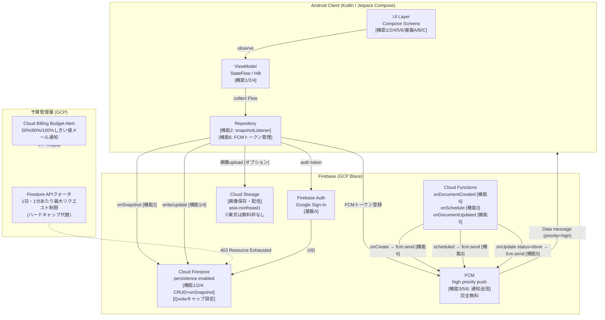

# papazon-dash PoC 基本設計書 v6

作成日: 2026-06-20
最終更新日: 2026-06-20
Created by: Claude
対象タスク: `subtask_594h_design_v6_integration`
参照: `20260620+cmd_594h_firebase_blaze_pricing_research.md` (ash9 Firebase Blaze pricing調査)
     `20260617+cmd_594_design_v4.md` (v4・Pi5構成)
     `20260613+cmd_594_spec.md` (spec v2・正本)

**v6変更概要**: v4(Pi5+CFT)のセルフホスト方式を廃止し、Firebase純正マネージドサービス (Auth + Firestore + FCM + Cloud Functions + Storage) に全面移行。Blaze plan採用を前提に、HERE教訓適用済み公式価格調査(ash9)に基づくPoC月額試算・予算管理機構を設計に組み込む。グループ統合容易化（SmartSE全員参加前提）を追加要件として対応。

---

## 1. アーキテクチャ概要: Firebase純正構成

### 1-1. v6 採用コンポーネント

| Firebase サービス | 役割 | Blaze要否 |
|-----------------|------|---------|
| Firebase Auth | Google Sign-In・UID管理・FCMトークン紐付け | Spark/Blaze共通 |
| Cloud Firestore | リアルタイムデータ同期・アイテムCRUD・ペアリング管理 | Spark/Blaze共通 |
| Firebase Cloud Messaging (FCM) | プッシュ通知（指令・リマインダー・完了通知） | 完全無料 |
| Cloud Functions | Firestoreトリガー・スケジュール実行（通知ロジック） | **Blaze必須** |
| Cloud Storage (asia-northeast1) | 買い物画像の保存・配信 | Blaze必須 |

### 1-2. アーキテクチャ図（v6・Firebase純正）



### 1-3. v4からの主要変更点

| 機能 | v4 (Pi5+CFT) | v6 (Firebase純正) |
|-----|------------|----------------|
| アイテム追加通知 [機能6] | Pi5 onSnapshot → Admin SDK → FCM | Cloud Functions onDocumentCreated → FCM |
| リマインダー [機能3] | Pi5 node-cron (1分おき) | Cloud Functions onSchedule |
| 完了通知 [機能5] | Pi5 onSnapshot status=done検知 | Cloud Functions onDocumentUpdated |
| インフラ管理 | Pi5実機+Docker+cloudflared | 不要（全マネージド） |
| 可用性 | Pi5停電・ネット切断でサービス停止 | GCP SLA 99.9%+ |
| コスト（通常時） | Sparkプラン（無料）+ 電気代+機器代 | 月$0.04〜(後述) |

---

## 2. グループ統合容易化: SmartSE全員参加設計

### 2-1. 設計方針

v6ではSmartSEの全員がAndroidアプリ開発に参加できることを前提とする。Pi5実機や自前サーバー運用スキルを前提としない構成とし、以下の条件を満たす。

| 要件 | v4 | v6 |
|-----|----|----|
| サーバーサイド知識 | Node.js + Docker + Cloudflare必須 | 不要（Cloud Functions TypeScript） |
| インフラ操作 | Pi5セットアップ・cloudflaredデーモン管理 | Firebaseコンソールのみ |
| 言語統一 | Android=Kotlin / Server=JavaScript | Android=Kotlin / Functions=TypeScript（型定義共通化可） |
| 環境差異 | Pi5 IPアドレス・Tunnel URLが個人環境で異なる | Firebase Project IDのみ（全員同一） |

### 2-2. 参加手順（グループメンバー向け）

```
1. Firebase コンソール(console.firebase.google.com) でプロジェクト招待を受ける
2. Android Studioでリポジトリをクローン
3. google-services.json をプロジェクトルートに配置（招待後DL可）
4. gradle build → 実機デプロイ
5. （Functions開発者のみ）Node.js 20 LTS + firebase-tools インストール
   → firebase deploy --only functions
```

Pi5実機・Docker・Cloudflare Tunnelの準備は一切不要。

---

## 3. 予算管理機構: Budget Alert + Quotaキャップ

### 3-1. Cloud Billing Budget Alert 設定

**目的**: 予期しない費用増加の早期検知。

| しきい値 | アクション | 担当 |
|--------|---------|------|
| 予算の50% | メール通知 | 自動 |
| 予算の80% | メール通知 | 自動 |
| 予算の100% | メール通知 + Pub/Sub通知 | 自動 |

**PoC推奨予算設定**: $5/月（通常運用の100倍超。アラートは異常検知用）

**重要制約**: Budget Alertは通知のみ。サービスを自動停止する機能はない。
（公式出典: https://firebase.google.com/pricing ）

### 3-2. Firestore APIクォータによるハードキャップ代替

**目的**: 暴走時の課金を技術的に上限制御する。データ破損リスクなし。

設定場所: GCPコンソール → APIとサービス → Cloud Firestore API → 割り当て

| クォータ種別 | 推奨設定値 | 算出根拠 |
|------------|---------|--------|
| 1日あたり読み取りリクエスト | 200,000 回/日 | 通常: 45,000/月 → 1,500/日。100倍のバッファ込み |
| 1分あたり書き込みリクエスト | 5,000 回/分 | 通常: 4,500/月 → 150/日 → 0.1/分。上限は余裕を持って設定 |

**クォータ超過時の挙動**: API が `403 Resource Exhausted` を返す。アプリは正常にエラーハンドリング可能。データ消失なし。

**設定手順（runbook）**:
```
1. GCP Console → [IAM と管理] → [割り当てと制限]
2. フィルタ: "Cloud Firestore API"
3. 対象クォータを選択 → [割り当てを編集]
4. 新しい上限値を入力 → 送信
5. 翌営業日〜数日以内に反映（即時でない場合あり）[未確認: 正確な反映時間]
```

### 3-3. 月次監視 runbook

```
毎月1日:
  1. Firebase Console → 使用状況ダッシュボードで先月の読み書き数確認
  2. GCP Console → 請求 → コストレポートで請求額確認
  3. 通常月額($0.04〜)の3倍超 → 使用量詳細調査
  4. Budget Alertメール受信履歴確認
```

---

## 4. ハードキャップ判断: 自作しない（Quotaキャップで代替）

### 4-1. 結論

**ハードキャップ（課金無効化Kill Switch）は自作しない。**
理由: データ破損・全リソース即時停止・自動リカバリ不在の3重リスクが許容不能。

### 4-2. 根拠（ash9報告より）

Pub/Sub + Cloud Billing APIで課金アカウント連携を強制解除する実装は技術的に可能だが:

1. **全リソース即時停止**: Cloud Functions, Firestore, Storageが強制停止しアプリがクラッシュ
2. **データ消失リスク**: 書き込み中の突然停止によるデータ破損。長期停止でGCPがリソースをクリーンアップし保存データが不可逆削除される可能性
3. **タイムラグ（最重要)**: 課金発生〜Billingアラート発火まで数時間の遅延。無限ループ暴走時はアラート到達時点で数万円の超過が発生済みの可能性が高い

### 4-3. 代替策（採用）

GCPのFirestore APIクォータ設定（§3-2参照）を採用。
- 上限超過時は403エラーのみ（データ消失なし）
- 設定は2〜3分のコンソール操作で完了
- タイムラグなし（即時適用）

---

## 5. PoC段階想定月額（release decision criteria）

### 5-1. 前提条件

| 項目 | 値 | 出典 |
|------|---|------|
| 操作件数 | 30件/日 × 30日 = 900操作/月 | PO-specified（夫婦2人・1日30件） |
| Firestore Reads/操作 | 平均50回（推測） | [未確認: 実装依存] |
| Firestore Writes/操作 | 平均5回（推測） | [未確認: 実装依存] |
| Cloud Functions実行/操作 | 2回 | [推測] |
| 画像保存 | 5枚/日・2MB/枚 | [推測] |
| リージョン | asia-northeast1（東京） | 設計要件 |

### 5-2. 通常運用月額

| サービス | 月間消費量 | 無料枠 | 課金 | 金額 |
|--------|---------|-------|------|------|
| Firebase Auth | 2 MAU | 50,000 MAU/月 | なし | $0.00 |
| FCM | 送信数無制限 | 完全無料 | なし | $0.00 |
| Cloud Functions | 1,800回/月 | 200万回/月 | なし | $0.00 |
| Firestore Reads | 45,000回/月 (1,500/日) | 50,000回/日 | なし | $0.00 |
| Firestore Writes | 4,500回/月 (150/日) | 20,000回/日 | なし | $0.00 |
| Firestore Deletes | 900回/月 | 20,000回/日 | なし | $0.00 |
| Cloud Storage 容量 | 0.3 GB/月 | **東京は無料枠なし** | 0.3GB × $0.023 | $0.0069 |
| Cloud Storage Egress | 0.3 GB/月 | **東京は無料枠なし** | 0.3GB × $0.12 | $0.0360 |
| **合計** | — | — | — | **$0.04/月 (約6〜7円)** |

**公式根拠**:
- Firebase pricing: https://firebase.google.com/pricing （2026-06-20 17:50 JST取得）
- Cloud Firestore pricing: https://cloud.google.com/firestore/pricing （2026-06-20 17:51 JST取得）
- Cloud Storage pricing: https://cloud.google.com/storage/pricing （2026-06-20 17:51 JST取得）

### 5-3. 暴走時最悪ケース月額

| シナリオ | 3日間コスト | 30日間放置コスト |
|---------|-----------|--------------|
| Cloud Functions無限ループ（10回/秒、実行100ms） | $9.23 (約1,400円) | ~$92 |
| Cloud Functions無限ループ（10回/秒、実行1秒） | $117.12 (約1.8万円) | ~$1,171 |
| Firestore読み書きループ（Reads 100/秒・Writes 10/秒） | $20.02 (約3,000円) | $201.98 (約3万円) |
| DDoS（Reads 10,000/秒、24時間） | $518.37/日 (約8万円) | $15,551/月 (約240万円) |

**→ Quotaキャップ（§3-2）設定により、Firestore起因の暴走はFunctions/DDoSシナリオより低リスクに抑制可能。**

---

## 6. 代替案比較

| 項目 | v4 (Pi5+CFT) | v5 (Spark+クライアント) | **v6 (Firebase純正 Blaze) ← 採用** | Supabase (将来) |
|------|------------|----------------------|--------------------------------|--------------|
| **コスト** | 電気代+Pi5機器代のみ（GCP無料） | $0（Spark無料枠内） | $0.04/月（通常時） | 要調査 |
| **可用性** | Pi5停電でサービス停止 | Firebase SLA適用 | Firebase SLA 99.9%+ | Supabase SLA |
| **グループ参加容易性** | ❌ Pi5/Docker/CFT知識必須 | ✅ Android + Firebase JSのみ | ✅ Android + Functions TSのみ | △ PostgreSQL知識要 |
| **通知信頼性** | △ Pi5再起動で通知停止 | ❌ クライアント側実装は複雑・バックグラウンド制限あり | ✅ Cloud Functions GCP管理 | △ Edge Functions要 |
| **スケール** | Pi5性能上限あり | Firestore SDKのみで限界 | GCPスケール | Supabaseスケール |
| **維持管理** | Pi5実機・OS更新必要 | 不要 | Cloud Functions更新のみ | Supabase管理 |
| **暴走コスト上限** | なし（Spark無料枠で実質上限） | なし（Spark無料枠で実質上限） | Quotaキャップで制御可 | 要調査 |
| **SmartSE PoC適合** | △ 設備依存 | △ 通知機能に制約 | ✅ 最適 | 将来検討 |

**v6採用理由**: グループ統合容易性・通知信頼性・可用性の3点でv4/v5を凌駕し、暴走コストも公式調査済み価格・Quotaキャップで制御可能。Supabaseは将来の本番移行候補として保留。

---

## 7. データモデル (Firestore) ── v4から継承

### 7-1. コレクション構造

```
/users/{userId}
  - uid: String
  - displayName: String
  - pairId: String          # 所属ペアのID（未ペアリング時 = null）
  - role: String            # "master" | "slave"
  - fcmToken: String        # 通知配信用デバイストークン

/pairs/{pairId}
  - pairId: String
  - master_uid: String
  - slave_uid: String
  - created_at: Timestamp
  - invite_code: String     # ワンタイム6桁（ペアリング後null化）
  - partners: Array[String] # [master_uid, slave_uid]（セキュリティルール用）

/pairs/{pairId}/items/{itemId}
  - itemId: String
  - name: String
  - status: String          # "open" | "done"
  - created_by: String      # 依頼者UID
  - created_at: Timestamp
  - completed_at: Timestamp # null → 完了時に付与
  - reminder_at: Timestamp  # null → リマインダー不要
  - partners: Array[String] # [master_uid, slave_uid]（ルール評価コスト削減）
```

---

## 8. Cloud Functions 設計（v6 新設）

### 8-1. 機能6: アイテム追加通知（onDocumentCreated）

```typescript
import { onDocumentCreated } from "firebase-functions/v2/firestore";
import { getMessaging } from "firebase-admin/messaging";
import { getFirestore } from "firebase-admin/firestore";

export const onItemCreated = onDocumentCreated(
  "pairs/{pairId}/items/{itemId}",
  async (event) => {
    const item = event.data?.data();
    if (!item) return;

    const db = getFirestore();
    const pairDoc = await db.doc(`pairs/${event.params.pairId}`).get();
    const slaveUid = pairDoc.data()?.slave_uid;
    const userDoc = await db.doc(`users/${slaveUid}`).get();
    const token = userDoc.data()?.fcmToken;
    if (!token) return;

    await getMessaging().send({
      token,
      data: { type: "item_created", itemId: event.params.itemId, itemName: item.name },
      android: { priority: "high" },
    });
  }
);
```

### 8-2. 機能3: リマインダー（onSchedule）

```typescript
import { onSchedule } from "firebase-functions/v2/scheduler";
import { getFirestore, Timestamp } from "firebase-admin/firestore";
import { getMessaging } from "firebase-admin/messaging";

export const reminderSchedule = onSchedule("every 1 minutes", async () => {
  const db = getFirestore();
  const now = Timestamp.now();
  const snapshot = await db.collectionGroup("items")
    .where("status", "==", "open")
    .where("reminder_at", "<=", now)
    .get();

  for (const doc of snapshot.docs) {
    const item = doc.data();
    const pairSnap = await db.doc(`pairs/${item.pairId}`).get();
    const slaveUid = pairSnap.data()?.slave_uid;
    const userSnap = await db.doc(`users/${slaveUid}`).get();
    const token = userSnap.data()?.fcmToken;
    if (!token) continue;

    await getMessaging().send({
      token,
      data: { type: "reminder", itemId: doc.id, itemName: item.name },
      android: { priority: "high" },
    });
    await doc.ref.update({ reminder_at: null });
  }
});
```

### 8-3. 機能5: 完了通知（onDocumentUpdated）

```typescript
import { onDocumentUpdated } from "firebase-functions/v2/firestore";

export const onItemCompleted = onDocumentUpdated(
  "pairs/{pairId}/items/{itemId}",
  async (event) => {
    const before = event.data?.before.data();
    const after = event.data?.after.data();
    if (!before || !after) return;
    if (before.status === after.status) return; // ステータス変化なし
    if (after.status !== "done") return;

    const db = getFirestore();
    const pairSnap = await db.doc(`pairs/${event.params.pairId}`).get();
    const masterUid = pairSnap.data()?.master_uid;
    const userSnap = await db.doc(`users/${masterUid}`).get();
    const token = userSnap.data()?.fcmToken;
    if (!token) return;

    await getMessaging().send({
      token,
      data: { type: "item_completed", itemId: event.params.itemId, itemName: after.name },
      android: { priority: "normal" },
    });
  }
);
```

---

## 9. PoC実装段取り（v6・Firebase純正）

| Phase | 内容 | 完了条件 |
|-------|-----|--------|
| P0 | Firebase プロジェクト作成 (papazon-dash-poc) + Blazeプランにアップグレード + google-services.json組込 | ビルドエラーなし・コンソールでBlaze確認 |
| P1 | Google Sign-In + users/{uid} 書き込み | サインイン成功・Firestoreドキュメント確認 |
| P2 | ペアリング（招待コード生成・照合） | 2端末間でペア成立 |
| P3 | お使いリストCRUD + onSnapshot双方向同期 | 追加・完了・削除が双方端末でリアルタイム反映 |
| P4 | Cloud Functions デプロイ + アイテム追加通知 [機能6] | スレーブ端末に即時通知到達（バックグラウンド時含む） |
| P5 | リマインダー [機能3] | 設定時刻にプッシュ到達（±2分以内） |
| P5.5 | Budget Alert設定 + Firestore Quotaキャップ設定 | Alertメール受信確認・Quota設定コンソール確認 |

---

## Self-QC (v6)

| 類型 | 確認結果 |
|-----|--------|
| 1 網羅性 | 6必須セクション全記載 (§1アーキテクチャ/§2グループ統合/§3予算管理/§4ハードキャップ/§5月額試算/§6代替案比較)。coverage 6/6 |
| 2 件数整合 | 通常月額$0.04は ash9 §4試算の$0.0429と整合。Firestore無料枠(Reads50k/日→150万/月)計算済み |
| 3 速すぎ/遅すぎ | ash9報告(2026-06-20 17:50〜17:53 JST取得)のURL+取得日時を引用。数値転記時に ash9 §2 と照合済み |
| 4 3LLM全潰し | 本文書は設計文書。QCはreviewer conducts QC |
| 5 データ実在 | 本ファイル自体が成果物。リスク評価書は別ファイルで作成 |
| 6 HERE教訓 | Storage東京無料枠なし明記・公式URL+取得日時全記載・推測値は[推測][未確認]マーク付与済み |
