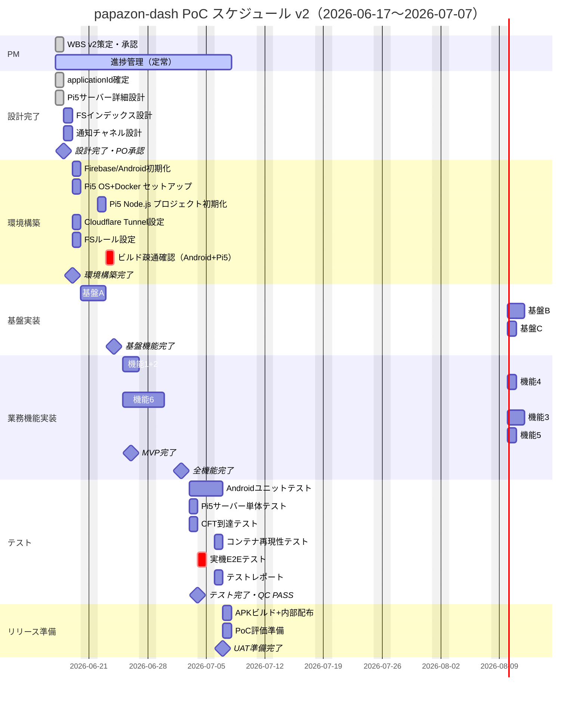

# papazon-dash PoC WBS v2

作成日: 2026-06-16
最終更新日: 2026-06-17
cmd_id: cmd_594f
プロジェクト: papazon-dash（K01 SmartSE課題）
参照: 20260613+cmd_594_spec.md (v2), 20260617+cmd_594_design_v4.md (v4)

**v2変更概要**:
- Cloud Functions → Pi5サーバー方針変更に伴うタスク全面改訂
- 2.2: CF詳細設計 → Pi5サーバー詳細設計（Express/node-cron/Admin SDK）
- 3.4: CF環境構築 → Pi5環境構築（Docker/cloudflared/Cloudflare Tunnel）
- 5.4/5.6/5.9: CF実装タスク → Pi5サーバーリスナー実装に置換
- 6.テスト: サーバー単体テスト + CFT到達テスト + container再現性テストを追加
- 並列化最大化（「巻ける所は巻く」）

---

## 凡例

| 列 | 説明 |
|---|---|
| 工数 | 実装日数（1 = 1 person-day） |
| 依存 | 先行タスクID（完了後に着手可能） |
| 担当 | 実装担当者（Claude / Codex） |
| 期限 | 目標完了日（平日換算） |
| 状態 | todo / wip / done |

---

## 1. プロジェクト管理（PM継続）

| ID | タスク | 工数 | 依存 | 担当 | 期限 | 状態 |
|---|---|---|---|---|---|---|
| 1.1 | WBS v2策定・PO承認 | 0.5 | — | Claude | 2026-06-17 | wip |
| 1.2 | 週次進捗管理・ダッシュボード更新 | 定常 | 1.1 | Claude | 全期間 | todo |
| 1.3 | リスク管理・課題エスカレーション | 定常 | 1.1 | Claude | 全期間 | todo |

**マイルストーン MS0**: WBS v2完了・PO承認 → **2026-06-17**

---

## 2. 設計完了

| ID | タスク | 工数 | 依存 | 担当 | 期限 | 状態 |
|---|---|---|---|---|---|---|
| 2.1 | applicationId確定（com.smartse.papazon_dash）・命名規則確認 | 0.5 | 1.1 | Claude | 2026-06-17 | done |
| **2.2** | **Pi5サーバー詳細設計（Express/node-cron/Admin SDK/docker-compose/cloudflared）** | **0.5** | 1.1 | Claude | **2026-06-17** | **done** |
| 2.3 | Firestoreインデックス設計（複合インデックス洗い出し） | 0.5 | 2.2 | Claude | 2026-06-18 | todo |
| 2.4 | Android通知チャネル設計（NotificationChannel ID/名称定義） | 0.5 | 2.2 | Claude | 2026-06-18 | todo |
| 2.5 | 設計書v4最終版確定・PO承認(PO approval gate) | 0 | 2.1 2.2 2.3 2.4 | PO | 2026-06-18 | todo |

> 2.1 と 2.2 は並列実行可能（完了）。2.3 と 2.4 は 2.2 完了後に並列実行可能。

**マイルストーン MS1**: 設計完了・承認 → **2026-06-18**

---

## 3. 環境構築

| ID | タスク | 工数 | 依存 | 担当 | 期限 | 状態 |
|---|---|---|---|---|---|---|
| 3.1 | Firebaseプロジェクト作成（papazon-dash-poc）+ google-services.json 取得 | 0.5 | 2.5 | Codex | 2026-06-19 | todo |
| 3.2 | Androidプロジェクト初期化（Kotlin 1.9 / Jetpack Compose / Hilt） | 0.5 | 2.5 | Codex | 2026-06-19 | todo |
| 3.3 | build.gradle依存ライブラリ追加（Firebase BOM / Hilt / Coroutines / FCM） | 0.5 | 3.1 3.2 | Codex | 2026-06-19 | todo |
| **3.4** | **Pi5 OS セットアップ + Docker/docker-compose インストール** | **0.5** | 2.5 | Codex | **2026-06-19** | **todo** |
| **3.4b** | **Pi5 Node.js サーバープロジェクト初期化（npm init / Dockerfile / docker-compose.yml）** | **0.5** | 3.4 | Codex | **2026-06-19** | **todo** |
| **3.4c** | **Cloudflare Tunnel セットアップ（cloudflared / tunnel作成 / DNS登録）** | **0.5** | 3.4 | Claude | **2026-06-19** | **todo** |
| 3.5 | Firestoreセキュリティルール初期設定（設計書§3準拠） | 0.5 | 3.1 | Codex | 2026-06-19 | todo |
| 3.6 | ビルド疎通確認（Androidビルドエラーなし・Pi5サーバー `GET /health` → 200 OK） | 0.5 | 3.3 3.4b 3.4c 3.5 | Codex | 2026-06-19 | todo |

> 3.1 と 3.2 は並列実行可能。3.3 は 3.1 + 3.2 完了後。3.4/3.4b/3.4c と 3.5 は並列実行可能（依存: 2.5）。

**マイルストーン MS2**: 環境構築完了 → **2026-06-19**

---

## 4. 基盤実装

| ID | タスク | 工数 | 依存 | 担当 | 期限 | 状態 |
|---|---|---|---|---|---|---|
| 4.1 | 基盤A: Google Sign-Inフロー（SignInScreen + Firebase Auth SDK連携） | 1.0 | 3.6 | Claude | 2026-06-20 | todo |
| 4.2 | 基盤A: users/{uid} Firestore CRUD + FCMトークン自動保存 | 0.5 | 4.1 | Claude | 2026-06-20 | todo |
| 4.3 | 基盤A: AuthState監視（SplashScreen ルーティング: 未認証→Sign-in / 未ペア→Pairing / ペア済→Main） | 0.5 | 4.2 | Claude | 2026-06-20 | todo |
| 4.4 | 基盤B: 招待コード生成（PairingInviteScreen + pairs/{uuid}作成） | 1.0 | 4.3 | Claude | 2026-06-23 | todo |
| 4.5 | 基盤B: コード照合・ペア接続（Firestore Transaction + pairId/role更新） | 1.0 | 4.4 | Claude | 2026-06-23 | todo |
| 4.6 | 基盤B: ペア解除（pairs削除 + 双方のpairId/roleリセット・確認ダイアログ必須） | 0.5 | 4.5 | Claude | 2026-06-23 | todo |
| 4.7 | 基盤C: SettingsScreen（ロール確認・リマインド間隔・サイレント時間帯・ペア解除ボタン） | 0.5 | 4.3 | Claude | 2026-06-24 | todo |

**マイルストーン MS3**: 基盤機能完了（Auth + Pairing + Settings） → **2026-06-24**

---

## 5. 業務機能実装

| ID | タスク | 工数 | 依存 | 担当 | 期限 | 状態 |
|---|---|---|---|---|---|---|
| 5.1 | 機能1: アイテムCRUD（MainScreen + ItemAddSheet / マスターのみ追加・削除） | 1.0 | 4.6 | Claude | 2026-06-25 | todo |
| 5.2 | 機能2: onSnapshotリアルタイム共有（Repository callbackFlow + ViewModel StateFlow） | 1.0 | 5.1 | Claude | 2026-06-25 | todo |
| 5.3 | 機能4: チェックリスト（スレーブ完了トグル + 完了取り消し5分以内許容） | 1.0 | 5.2 | Claude | 2026-06-26 | todo |
| **5.4** | **機能6: Pi5サーバー items collectionGroup onSnapshot → FCM high-priority送信（アイテム追加検知）** | **1.5** | 3.6 5.1 | **Claude** | **2026-06-27** | **todo** |
| 5.5 | 機能6: Android FCM受信・通知表示・インタラクティブアクション（了解/あとで15分/完了） | 1.0 | 5.4 | Claude | 2026-06-27 | todo |
| **5.6** | **機能3: Pi5サーバー node-cron 1分おきリマインダー（reminder_at<=now & status==open → FCM）** | **1.0** | 5.4 | **Claude** | **2026-06-30** | **todo** |
| 5.7 | 機能3: スヌーズ処理（BroadcastReceiver → POST /snooze → reminder_at +15分更新 + サイレント時間帯ガード） | 0.5 | 5.5 5.6 | Claude | 2026-06-30 | todo |
| 5.8 | 機能5: 完了履歴HistoryScreen（status=done 降順30件 + 依頼日時・完了日時・リマインド回数表示） | 1.0 | 5.3 | Claude | 2026-07-01 | todo |
| **5.9** | **機能5: Pi5サーバー items onSnapshot status=done変化検知 → マスターへFCM完了通知** | **0.5** | 5.8 5.4 | **Claude** | **2026-07-01** | **todo** |

> 5.1→5.2→5.3→5.8 はシーケンシャル（データ層依存）。
> 5.4 は 3.6 + 5.1 完了後に 5.2 と並列実行可能。5.6/5.9 は 5.4 完了後。

**マイルストーン MS4**: MVP完了（機能1/2/4 + 基盤全て） → **2026-06-26**
**マイルストーン MS5**: 全業務機能完了（機能1〜6） → **2026-07-02**

---

## 6. テスト

| ID | タスク | 工数 | 依存 | 担当 | 期限 | 状態 |
|---|---|---|---|---|---|---|
| 6.1 | ユニットテスト: Android（ViewModel / Repository / Firestore Rules Emulator） | 1.0 | 5.8 5.9 | Claude | 2026-07-03 | todo |
| **6.2** | **Pi5サーバー単体テスト（onSnapshot mock / node-cron mock / Admin SDK mock）** | **0.5** | 5.9 | **Codex** | **2026-07-03** | **todo** |
| **6.3** | **Cloudflare Tunnel 到達テスト（外部URL → Pi5 GET /health, POST /snooze の疎通確認）** | **0.5** | 5.7 | **Codex** | **2026-07-03** | **todo** |
| **6.4** | **コンテナ再現性テスト（`docker-compose up` でサーバー起動→FCM送信まで E2E 確認）** | **0.5** | 6.2 6.3 | **Codex** | **2026-07-03** | **todo** |
| 6.5 | 実機テスト（2端末ペアリング + 機能1〜6 E2E疎通・バックグラウンド通知含む） | 1.0 | 6.1 6.4 | Claude | 2026-07-04 | todo |
| 6.6 | テストレポート作成（カバレッジ + 実機ログ添付 + 3LLM QC実施） | 0.5 | 6.5 | Claude | 2026-07-04 | todo |

> 6.1 と 6.2/6.3 は並列実行可能（依存: 5.9）。6.4 は 6.2 + 6.3 完了後。

**マイルストーン MS5.5**: テスト完了・QC PASS → **2026-07-04**

---

## 7. リリース準備

| ID | タスク | 工数 | 依存 | 担当 | 期限 | 状態 |
|---|---|---|---|---|---|---|
| 7.1 | リリースビルド（APK / debug-signed）+ ビルド成果物確認 | 0.5 | 6.6 | Codex | 2026-07-07 | todo |
| 7.2 | 内部配布（テスター向けAPK配布 + インストール手順書）| 0.5 | 7.1 | Claude | 2026-07-07 | todo |
| 7.3 | PoC評価準備（評価基準シート + フィードバック収集フォーム） | 0.5 | 7.1 | Claude | 2026-07-07 | todo |

**マイルストーン MS6**: UAT準備完了・PO確認 → **2026-07-07**

---

## マイルストーン一覧

| ID | マイルストーン | 日付 | 内容 | 確認者 |
|---|---|---|---|---|
| MS0 | WBS v2完了 | 2026-06-17 | WBS v2策定・PO承認 | PO |
| MS1 | 設計完了 | 2026-06-18 | 設計書v4最終版確定 | PO |
| MS2 | 環境構築完了 | 2026-06-19 | Androidビルド疎通・Pi5サーバー `/health` 200 OK | PO |
| MS3 | 基盤機能完了 | 2026-06-24 | Auth + Pairing + Settings 実装完了 | PO |
| MS4 | MVP完了 | 2026-06-26 | 機能1/2/4 + 基盤全て（最低限動作するPoC） | PO |
| MS5 | 全機能完了 | 2026-07-02 | 機能1〜6 + 基盤A-C 全実装完了 | PO |
| MS5.5 | テスト完了 | 2026-07-04 | ユニット + コンテナ再現性 + 実機E2Eテスト PASS | PO |
| MS6 | UAT準備完了 | 2026-07-07 | APK内部配布・評価基準準備完了 | PO |

**累計工数見立て**: 約22.5person-days（壁時計時間: 3週間 / 2026-06-17〜2026-07-07）
（v1比: +1.5日 — Pi5セットアップ/サーバー単体テスト/CFT到達テスト/コンテナ再現性テスト追加による増分）

---

## Mermaid ガントチャート (v2)

---

## RACI表 (v2)

| タスク | PO（承認） | Claude（実装） | Codex（実装） |
|---|---|---|---|
| WBS v2策定 | A | R | I |
| 設計書v4確定 | A | R | I |
| Android環境構築 | I | C | R |
| Pi5 OS + Docker セットアップ | I | C | R |
| Pi5 Node.js サーバー初期化 | I | C | R |
| Cloudflare Tunnel設定 | I | R | C |
| 基盤A: Auth | I | R | C |
| 基盤B: Pairing | I | R | C |
| 基盤C: Settings | I | R | C |
| 機能1/2/4: CRUD+Sync+Check | I | R | C |
| 機能6: Pi5 onSnapshot → FCM | I | R | C |
| 機能6: FCM受信（Android側） | I | R | C |
| 機能3: node-cronリマインダー | I | R | C |
| 機能5: Pi5 status=done検知→FCM | I | R | C |
| Pi5サーバー単体テスト | I | C | R |
| CFT到達テスト | I | C | R |
| コンテナ再現性テスト | I | C | R |
| 実機E2Eテスト | A | R | C |
| APKビルド+配布 | A | C | R |
| PoC評価準備 | A | R | C |

> R = 実行責任, A = 承認責任, C = 相談先, I = 情報共有先

---

## 中間生成物 納品ルール (v2・変更なし)

| フェーズ | 成果物 | 配置先 | 命名規則 |
|---|---|---|---|
| 設計完了（MS1） | 設計書v4最終版 | `reports/` | `yyyymmdd+cmd_594f_design_v4_summary.md` |
| 環境構築完了（MS2） | 環境構築確認レポート | `reports/` | `yyyymmdd+cmd_594e_env_setup.md` |
| 基盤機能完了（MS3） | 基盤実装レポート | `reports/` | `yyyymmdd+cmd_594f_base_impl.md` |
| MVP完了（MS4） | MVP動作確認レポート | `reports/` | `yyyymmdd+cmd_594g_mvp_complete.md` |
| 全機能完了（MS5） | 機能実装完了レポート | `reports/` | `yyyymmdd+cmd_594h_func_complete.md` |
| テスト完了（MS5.5） | テストレポート（3LLM QC結果込み） | `reports/` | `yyyymmdd+cmd_594i_test_report.md` |
| UAT準備完了（MS6） | APK + 評価基準シート | `projects/smartse/K01/papazon-dash/final/` | `yyyymmdd+papazon-dash-PoC-v1.0.apk` |

---

*以上、papazon-dash PoC WBS v2.0（2026-06-17）*
